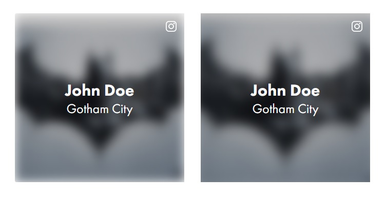

# SVG-анимация
## атрибут `id`
Все значения атрибутов `id` у тегов анимации (`<animate>`, `<animateTransform>` и др.) должны быть написаны без символа `-`. Иначе это может привести к некорректной работе анимации в некоторых браузерах. Например, в случае с Firefox:
```
<animate id="eye-close" attributeName="d" values="..." dur="150ms" fill="freeze" begin="1000ms" />
<animate id="eye-open" attributeName="d" values="..." dur="150ms" fill="freeze" begin="eye-close.end+500ms" />
```
- первая анимация (`id="eye-close"`) запускается по прошествии одной секунды (`begin="1000ms"`)
- вторая анимация (`id="eye-open"`) запускается через пол секунды после завершения первой анимации (`begin="eye-close.end+500ms"`)

В данном случае вторая анимация вообще не сработает, потому что Firefox воспринимает символ `-` в качестве оператора вычитания, что ломает всю логику написанного выражения. Поэтому необходимо избегать символ `-` в значении атрибута `id` и использовать вместо него нижнее подчёркивание или CamelCase, либо любой другой разрешённый синтаксис.

## морфинг `<path>`
Для анимации атрибута `<d>` начальная, конечная и любые промежуточные фигуры должны иметь одинаковое количество координат и параметров. Следовательно, SMIL-анимация прямой линии в кривую Безье невозможна, потому что преобразование в кривую меняет количество параметров в атрибуте `<d>`. Чтобы задействовать SMIL-анимацию для такого преобразования, необходимо изначально преобразовать все прямые линии фигуры в кривые Безье, это можно сделать незаметно, изменив уровень выпуклости или вогнутости прямой линии на 0,1%, что визуально не будет заметно.

Пример простой анимации:
```
<path d="m 53.73,85.903863 a 3.73,3.73 0 1 0 -3.73,-3.73 3.74,3.74 0 0 0 3.73,3.73 z">
  <animate attributeName="d" values="m 53.73,85.903863 a 3.73,3.73 0 1 0 -3.73,-3.73 3.74,3.74 0 0 0 3.73,3.73 z;m 53.73,91.660547 a 3.73,3.73 0 1 0 -3.73,-3.73 3.74,3.74 0 0 0 3.73,3.73 z;m 53.73,85.903863 a 3.73,3.73 0 1 0 -3.73,-3.73 3.74,3.74 0 0 0 3.73,3.73 z" dur="200ms" begin="600ms" />
</path>
```

> _информация по основной анимации: https://css-tricks.com/guide-svg-animations-smil/_

# Flexbox
Если ребёнку flexbox-блока необходимо задать размер по главной оси (main axis), то для корректного кросс-браузерного отображения необходимо это делать через свойство `flex`, указав три соответствующих значения (`flex-grow`, `flex-shrink`, `flex-basis`), а не через свойство `width`. Самая проблемная в данном случае ситуация возникает с тегом изображения и его стандартным атрибутом `width`. Например:
```

```
Если это изображение является ребёнком flexbox-блока и у этого изображения есть соседи, размер которых высчитывается автоматически, то при нехватке места само изображение и его соседи будут неравномерно сжаты. При этом размеры изображения будут высчитываться на основе значения атрибута `width`, что подразумевает ещё большую путаницу. Поэтому размеры необходимо указывать через свойство `flex`.

# Статистика
Инструмент для анализа глобального веб-трафика. Браузеры, ОСи, девайсы и версии: http://gs.statcounter.com/
* версии iOS: http://gs.statcounter.com/ios-version-market-share/mobile/worldwide/
* вид девайса: http://gs.statcounter.com/platform-market-share/desktop-mobile-tablet
* браузеры: http://gs.statcounter.com/browser-market-share

# User-Agent
Идентификация браузера на основе обнаружения строки агента пользователя (`window.navigator.userAgent`) является ненадежной и не рекомендуется, так как строка пользовательского агента может быть изменена пользователем.

**Почему везде `Mozilla/5.0`?**<br>
Первый «Mozilla» был переименован в «Netscape Navigator», но в User-Agent позиционировался как `Mozilla/1.0`. Он первым начал поддерживать фреймы и быстро расти в плане функционала. Вебмастеры начали различать браузеры по юзерагенту, чтобы знать, когда использовать определённый функционал. Однажды:
> Netscape сказал "давайте посмеемся над Microsoft" и ссылался на Windows как на «плохо отлаженные драйверы устройств»

После этого Microsoft сделали «Internet Explorer», который тоже мог во фреймы, поэтому в юзерагенте они написали `Mozilla/1.22 (compatible; MSIE 2.0; Windows 95)`, чтобы уже имеющиеся сайты могли использовать функционал «Netscape Navigator» в IE. Так User-Agent всех браузеров и превратился в User-Agent «Mozilla»

> _краткая история войны браузеров: https://habr.com/ru/post/84222/_

# Стилизация
## размытие
При наложении фильтра размытия на какой-либо элемент, при необходимости можно накинуть `transform: scale();` для увеличения занимаемой области размытого объекта, что поможет убрать размытые полупрозрачные края, переходящие в фоновый цвет элемента, находящегося позади. На изображении ниже можно увидеть наглядный пример.



# SLICK
Если слайдер находится во flex-блоке, то его ширина высчитывается неправильно, поэтому она бесконечно увеличивается независимо от стандартной ширины родителя. В разных ситуациях фиксится разными методами, чаще всего необходимо задать контейнеру, в котором находится слайдер, следующее правило: `overflow: hidden;`, либо самому слайдеру: `width: 100%;`

Другие фиксы, которые могут помочь:
* `min-height: 0;`
* `min-height: 0;`
* `min-width: 1px;`
---
В ожидании функции свободной прокрутки:<br>
https://github.com/kenwheeler/slick/issues/1665<br>
https://github.com/kenwheeler/slick/issues/3461

# РЕСУРСЫ
* FREE SVG: https://www.flaticon.com
* FREE SVG: https://thenounproject.com
* FREE LINEAR SVG: https://linearicons.com/free
* ICON (SVG) FONTS: https://icomoon.io/app
